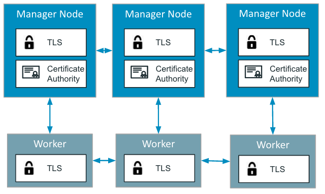

## Quelques rappels sur Docker Swarm

Swarm est la solution de clustering de Docker et permet entre autres:
- le management d’un cluster d’hôtes Docker
- l’orchestration de services sur ce cluster

Un cluster Swarm est composé de 2 types de nodes:
- les managers dont le rôle est de maintenir l’état du cluster. En interne, une implémentation de l’algorithme de consensus Raft est utilisée pour assurer cette fonction.
- les workers dont le rôle est d’exécuter des tasks (= lancer des containers)

Note: par défaut, un manager est également un worker.

Le schéma suivant montre la vision haut niveau d’un cluster Swarm.


Par défaut, un Swarm est sécurisé:
- encryption des logs nécessaires à la gestion du cluster
- communication TLS entre les différents nodes
- auto-rotation des certificats



Dans la suite, nous allons créer un cluster swarm en local composé d’un manager et de 2 workers.
Pour effectuer cela, nous utiliserons [Multipass](https://multipass.run) un outils très pratique de Canonical qui permet de créer des machines virtuelles en local.

Note: n'hésitez pas à vous reporter à l'exercice sur Multipass dans la section 2 pour vous familiariser avec l'utilisation de cet outil.

## Création des VMs avec Multipass

Utilisez les commandes suivantes afin de créer les 3 VMs (*node1*, *node2* et *node3*) sur lesquelles sera déployé le cluster Swarm:

```
multipass launch -n node1
multipass launch -n node2
multipass launch -n node3
```

## Installation de Docker

Utilisez les commandes suivantes pour installer Docker sur chacune de ces VMs:

```
# Installation sur node1
multipass exec node1 -- /bin/bash -c "curl -fsSL https://get.docker.com | sh -"
multipass exec node1 -- sudo usermod -aG docker ubuntu

# Installation sur node2
multipass exec node2 -- /bin/bash -c "curl -fsSL https://get.docker.com | sh -"
multipass exec node2 -- sudo usermod -aG docker ubuntu

# Installation sur node3
multipass exec node3 -- /bin/bash -c "curl -fsSL https://get.docker.com | sh -"
multipass exec node3 -- sudo usermod -aG docker ubuntu
```

## Création du swarm

Maintenant que nous avons créé les 3 hôtes Docker, nous allons les mettre en cluster en créant un swarm.

### Initialisation à partir de node1

Utilisez la commande suivante afin de lancer un shell sur node1:

```
multipass shell node1
```

Depuis ce shell initialisez le Swarm:

```
docker swarm init
```

Vous obtiendrez un résultat similaire à celui ci-dessous:

```
Swarm initialized: current node (hu64m6y9eb9veokfowq2x6l03) is now a manager.

To add a worker to this swarm, run the following command:

    docker swarm join --token SWMTKN-1-2l5o3eqie84jx9n3ecob1porwlknbtrlvwlkvyigw6gk0u3f01-003n75g9e9ccvtbfv6sgf6hk4 192.168.205.3:2377

To add a manager to this swarm, run 'docker swarm join-token manager' and follow the instructions.
```

Le daemon Docker du node1 est maintenant en Swarm mode, listez les nodes de votre cluster:

```
$ docker node ls
ID                            HOSTNAME   STATUS    AVAILABILITY   MANAGER STATUS   ENGINE VERSION
hu64m6y9eb9veokfowq2x6l03 *   node1      Ready     Active         Leader           20.10.22
```

## Ajout des workers

Lancez un shell sur *node2* et *node3* depuis 2 nouveaux terminaux.

Depuis chacun de ces shell lancez la commande **docker swarm join...** obtenue lors de l’initialisation du Swarm.

```
docker swarm join --token SWMTKN-1-2l5o3eqie84jx9n3ecob1porwlknbtrlvwlkvyigw6gk0u3f01-003n75g9e9ccvtbfv6sgf6hk4 192.168.205.3:2377
```

Nous obtenons alors la réponse suivante

```
This node joined a swarm as a worker.
```

Depuis le node1 (seul manager de notre swarm), nous pouvons alors lister les nodes présents dans notre cluster.

```
$ docker node ls
ID                            HOSTNAME   STATUS    AVAILABILITY   MANAGER STATUS   ENGINE VERSION
hu64m6y9eb9veokfowq2x6l03 *   node1      Ready     Active         Leader           20.10.22
ocb85o62xb6sk8ohnjckhd60i     node2      Ready     Active                          20.10.22
i1a4szitqdr3t3ht8s0gaigew     node3      Ready     Active                          20.10.22
```

Le node1 est l’unique manager du cluster, node2 et node3 sont des workers.

Note: toutes les commandes du client Docker doivent être envoyées sur un manager, si nous lançons la commande précédente sur node2 ou node3, nous obtenons l’erreur suivante.

```
$ docker node ls
Error response from daemon: This node is not a swarm manager. Worker nodes can't be used to view or modify cluster state. Please run this command on a manager node or promote the current node to a manager.
```

## Inspection d'un hôte

Comme pour les autres primitives de la plateforme (containers, images, volumes, networks), la commande inspect permet d’obtenir la vue détaillée d’un node.

```
docker node inspect node1
```

Cette commande retourne entre autres:
- le status du node
- son rôle (manager vs worker)
- les plugins disponibles
- le certificat TLS

Nous pouvons utiliser les Go template afin d’obtenir une information précise contenue dans cette structure json. Par exemple, la commande suivante permet de récupérer l’adresse IP du node directement.

```
docker node inspect -f "{{ .Status.Addr }}" node1
```

## Mise à jour d’un node

Une fois les nodes crées, il est possible de changer leur rôle et de:
- promouvoir un worker en manager
- destituer un manager en worker

### Promotion de node2

La commande suivante permet de changer le node2 et d'en faire un manager

```
docker node promote node2
```

Les commandes Docker peuvent maintenant être lancées depuis node1 ou node2 puisque tous 2 sont des managers.

```
$ docker node ls
ID                            HOSTNAME   STATUS    AVAILABILITY   MANAGER STATUS   ENGINE VERSION
hu64m6y9eb9veokfowq2x6l03 *   node1      Ready     Active         Leader           20.10.22
ocb85o62xb6sk8ohnjckhd60i     node2      Ready     Active         Reachable        20.10.22
i1a4szitqdr3t3ht8s0gaigew     node3      Ready     Active                          20.10.22
```

Le node2 a l’entrée Reachable dans la colonne MANAGER STATUS, ce qui signifie qu’il est du type manager, mais pas Leader.

### Destitution du node2

Depuis node1 ou node2, nous pouvons destituer le node2 et le repasser en worker.

```
docker node demote node2
```

Si nous listons une nouvelle fois les nodes du cluster, nous pouvons voir que le node2 n’a plus d’entrée dans la colonne MANAGER STATUS.

```
$ docker node ls
ID                            HOSTNAME   STATUS    AVAILABILITY   MANAGER STATUS   ENGINE VERSION
hu64m6y9eb9veokfowq2x6l03 *   node1      Ready     Active         Leader           20.10.22
ocb85o62xb6sk8ohnjckhd60i     node2      Ready     Active                          20.10.22
i1a4szitqdr3t3ht8s0gaigew     node3      Ready     Active                          20.10.22
```

## Résumé

Nous avons vu dans cet exercice la façon de créer un swarm en local. Nous avons utilisé pour cela Multipass, un utilitaire très pratique pour lancer des machines virtuelles Ubuntu que ce soit sur un environnment MacOS, Windows ou Linux.
